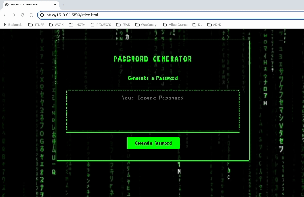

# JavaScript - Homework 2:  Password-Generator
Module 5 Challenge: Password Generator

## Description

Write a JavaScript program that an employee can use to generate a random password based on criteria they’ve selected. This app will run in the browser, and will feature dynamically updated HTML and CSS powered by JavaScript code. It will have a clean and polished user interface that is responsive, ensuring that it adapts to multiple screen sizes.

The password must meet the following criteria:

• At least 8 characters but no more than 128.

• Can contain lowercase, uppercase, special, or numeric characters.

• Must contain at least one of the above character types.

• Once all prompts are answered, the password is generated and displayed on the index.html site.

### Tasks completed

* When the page is loaded and the 'Generate Password' button is pressed, the user will be prompted to select password length, and then choose character types. The app will then generate and display a password.

### Links

[Link to the deployed website](https://jonnoclifford.github.io/Password-Generator/)

[Link to the code repository](https://github.com/jonnoclifford/Password-Generator)

## Installation

No installation required - index.html, style.css, script.js, images and this README pushed to Github.

## Usage

Open website at [https://jonnoclifford.github.io/Password-Generator](https://jonnoclifford.github.io/Password-Generator) and then click 'Generate Password'.

## Mock-Up

The following image shows the web application's appearance and functionality:

## Credits

Supported by Edx teaching staff and multiple YouTube tutorials and forum articles, including:

• How To Generate a Password Random Using JavaScript: GreatStack: https://www.youtube.com/watch?v=Xrsb9SiF3a8

• Random Password Generator in JavaScript: Beginner Tutorial - Code Radiance: https://www.youtube.com/watch?v=m5XF1OQ6rSg

• Build A Password Generator With JavaScript - Tutorial - Web Dev Simplified: https://www.youtube.com/watch?v=iKo9pDKKHnc

• Build a Password Generator with JavaScript - Scaler Topics: https://www.scaler.com/topics/password-generator-javascript/

• Random Password Generator using Javascript - DEV: https://dev.to/code_mystery/random-password-generator-using-javascript-6a

## License

MIT License

Copyright (c) 2023 Jonathan Clifford

Permission is hereby granted, free of charge, to any person obtaining a copy
of this software and associated documentation files (the "Software"), to deal
in the Software without restriction, including without limitation the rights
to use, copy, modify, merge, publish, distribute, sublicense, and/or sell
copies of the Software, and to permit persons to whom the Software is
furnished to do so, subject to the following conditions:

The above copyright notice and this permission notice shall be included in all
copies or substantial portions of the Software.

THE SOFTWARE IS PROVIDED "AS IS", WITHOUT WARRANTY OF ANY KIND, EXPRESS OR
IMPLIED, INCLUDING BUT NOT LIMITED TO THE WARRANTIES OF MERCHANTABILITY,
FITNESS FOR A PARTICULAR PURPOSE AND NONINFRINGEMENT. IN NO EVENT SHALL THE
AUTHORS OR COPYRIGHT HOLDERS BE LIABLE FOR ANY CLAIM, DAMAGES OR OTHER
LIABILITY, WHETHER IN AN ACTION OF CONTRACT, TORT OR OTHERWISE, ARISING FROM,
OUT OF OR IN CONNECTION WITH THE SOFTWARE OR THE USE OR OTHER DEALINGS IN THE
SOFTWARE.
